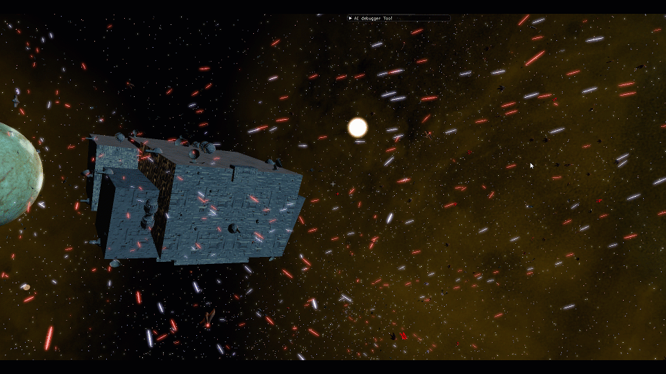
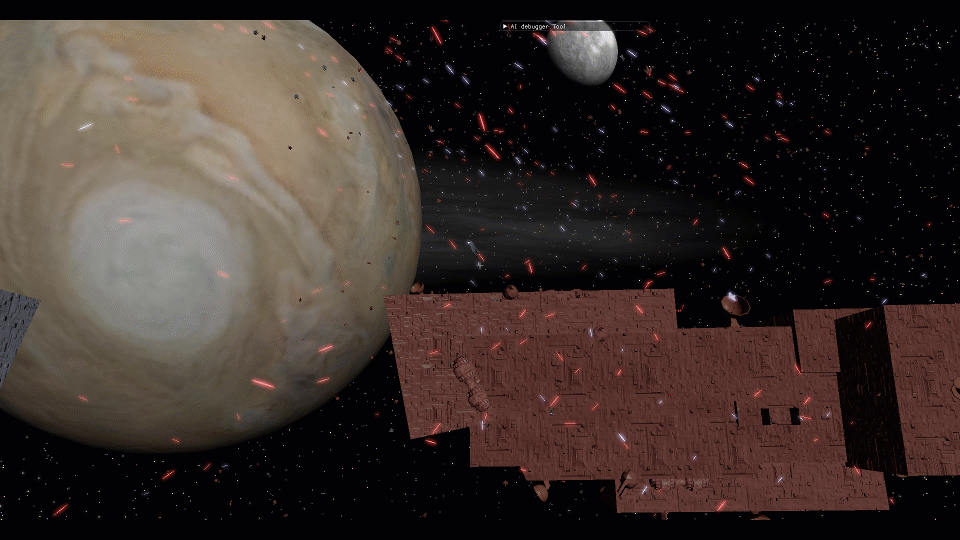
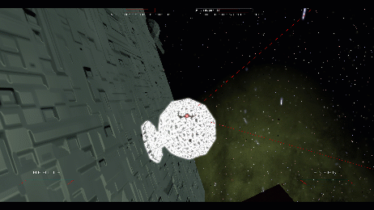
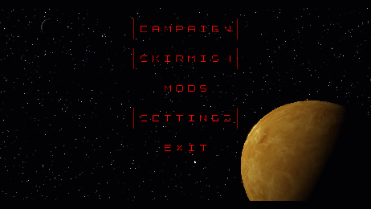

# Space Battle Arcade

A modifiable game for creating giant space battles.












The game is a complete standalone experience for creating large battles


It comes with a campaign of hand crafted levels


Complete with tools to make new levels and new space ships based on user created models


# Running The Game

I have provided a zipped game binary in `GameBinary.zip`. Just extract that and run `Space_Battle_Arcade.exe`. Alternatively you can build it from the source (See below). If using the old method, once you have done built, be sure to copy all the dll and other files in `OPEN_GL_REQUIREMENTS\dlls` and `OPEN_AL_REQUIREMENTS\lib\OpenAL` into the same folder that the game exe is in. 

note for `macOS`: you may need to launch the application from terminal for relative paths for GameData to be found correctly. **Open a terminal at the directory; do not use right click menus**. In the terminal, type `./SpaceBattleArcade` to launch the game such that the game can find the files in `./GameData/`.

# The Game Code

The game is primarily a single threaded modern opengl application. 
This game started as a learning project, so the code should not be considered best practice; some places are better written than other places.
The repository base folders contain many opengl examples.
However, the game code can be found in `Space_Battle_Arcade\Space_Battle_Arcade\Space_Battle_Arcade\new_src\Prototypes\SpaceArcade`
The primary class to start looking at is `GameBase` which is essentially the engine. All primary systems can be found in its `GameBase.h`.
The second class to consider is `SpaceArcade`, this is the game-specific subclass of GameBase. It also contains many game specific systems, such as the modding system.
Remember, this was a learning project, so there are some inconsistencies in the way things are done, mostly because I've learned many new things while working on this project. 

# Building The Game

## New Build Method
The project has been refactored to a cross platform CMake project targeting Linux, Windows, and Mac. I recommend opening the folder containing the top-level CMakeLists.txt file in your IDE (folder: `repository/Space_Battle_Arcade`). VSCode, VisualStudio, and CLion support opening CMake projects natively. Alternatively, you can build from the command line. 

**Linux Note 1**: on linux I needed to install these dependencies system wide:
`sudo apt-get install cmake clang build-essential libx11-dev libxrandr-dev libxinerama-dev libxcursor-dev libxi-dev libpulse-dev libasound2-dev` there may be others you need; when attempting to configure in CMake it will alert you to the dependencies you may be missing; I believe you want to install those libraries with the -dev extension. eg if mixxing `libxi`, install `libxi-dev`.

**Linux Note 2**: I highly recommend using Ninja instead of the default unix make file generators with cmake. The default makefiles do not seem to detect changes to source files and do not build your changes. Using ninja, it correctly detects source file changes are reubilds those files. I had to install `sudo apt-get install ninja-build` and then in vscode's file->preferences->settings, find the location for generator and set it to the case sensitive Cmake:Generator `Ninja`; or put this in your settings json file `"cmake.generator": "Ninja"` 

On linux I recommend compiling with `clang`, as that is what I tested.
```
#change directory to the directory containing the root level CMakeLists.txt
cd path/to/repository/Space_Battle_Arcade

#make a folder to build the project in
mkdir build

#change directories to our build folder
cd build

# configure the cmake project in the build folder, this generates platform specific project files 
# (like visual studio solutions, etc.).
# We pass .. to cmake, so cmake goes up a directory to find the appropriate CMakeLists.txt file.
cmake ..

# build the platform specific projects via command line in the current directory
cmake --build .
```
`Note`: there are some large file file names, cloning this repository to a minimal directory will avoid windows path limit issues. eg something like `c:\repos\SpaceArcade\` will probably be fine.

`Note`: this used to be a windows only project, and the original `.sln` is still checked in. When building the CMake project from visual studio, make sure you target the `SpaceBattleArcade.exe` and not the `SpaceBattleArcade.sln`. The `SpaceBattleArcade.sln` is the old visual studio project and appears as a build option even when opening the folder as a CMake project. I may remove this old way of building in a later commit.

## Old Build Method
A visual studio project is provided to build the game, but Microsoft does not recommend checking in files needed to set up the linker. So, I have provided a `copy.suo` file which is a copy of my `.suo` file that defines the linker settings. 
If you don't want to set up the dependencies manually, you will need to replace the .suo file with the copy.suo file; be sure to change the name from `copy.suo` to `.suo` ( the `.suo` file is found at the generated directory `s/Space_Battle_Arcade/Space_Battle_Arcade/.vs/Space_Battle_Arcade/v15/.suo`; running the visual studio .sln a single time is required for this directory to be generated)


# Modding The Game

When at the main menu, there is a section for mods. Following these menus will let you create modifications. The entire game is json. I recommend copying the base game, which itself is a mod, as a starting point for your mod.  `Space_Battle_Arcade\GameData\mods\SpaceArcade` is the base game mod.
The `GameData` folder will need to be placed wherever your .exe is located. If debugging with visual studio, the `GameData` folder will not be in the release folder or debug folder, rather it will be in a path something like this `Space_Battle_Arcade\Space_Battle_Arcade\Space_Battle_Arcade\GameData`. You'll need to copy any changes you make here to your Release and Debug folders if you want to run the .exe standalone while developing a mod. I recommend building mods while running the game through visual studio, that way you will know the cause of any crashes you may encounter.
Check out the dev blog for videos specifically on modding as they may provide some help in understanding how this works. https://www.youtube.com/playlist?list=PL22CMuqloY0qiYlv1Lm_QtfwuFz9OB0NE For the most part, modding is done within the model editor, which lets you set up models, collision, teams, projectiles, etc. And the level editor, used to layout levels in a campaign. 


# Packaging For Release

Build the game with `Release Min Size`. Then run the `prepare_release.py` script to copy only relevant files (skipping build files) to a created PACKAGE_GAME folder. You must pass the path to the application as a argument, and it will copy the relevant files to a subdirectory.
eg
`python prepare_release.py "c:/path/to/repo/SpaceBattleArcade_CMake/Space_Battle_Arcade/out/build/x64-Release-MinSize"`
Test running the application. Rename the folder to something useful, like PACKAGE_GAME_Win64_V1.0. Compress the folder. The game is now ready to distribute the compressed folder.


When packaging for release, it is important to test on a fresh computer.
A virtual machine is useful for that type of test.
Though virtual machines may not support needed versions of OpenGL, they should identify missing dlls before attempting to create an opengl context.

For example, on windws the executables will link against visual studio development libraries already present on the machine.
But on a machine without visual studio, those libraries will not be available from the system.
The solution is to provide the library dlls with the binary, copying the libraries next to the executable.
For example, the old windows project required getting the `ucrtbased.dll`, `vcruntime140.dll`, `msvcp140.dll` from the visual studio install directory and shipping them with the game, to avoid having an installer. (see `packaging_for_release_instructions.txt` for where to find these files)


# note

I've not yet chosen on a license, but know that this game is not a commercial project, and you can not sell it.